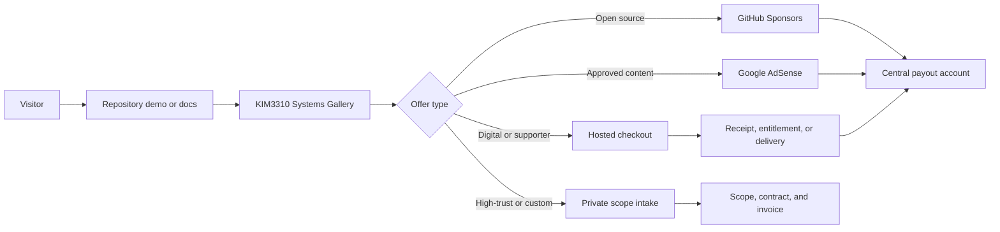

# Monetization Operating System

This is the operating source of truth for monetizing the 35 active GitHub
repositories without creating 35 payment accounts, policy stacks, or payout
flows.

## Revenue Rails

| Rail | Provider | Current state | Use |
| --- | --- | --- | --- |
| Global hosted checkout | Lemon Squeezy | Account onboarding required | Digital packs, supporter tiers, and bounded one-time products |
| Open-source support | GitHub Sponsors | Account onboarding required | Sustainable support for developer tools and public technical assets |
| Content advertising | Google AdSense | Site verified; review pending | `dream-interpretation-pages` only after approval |
| High-trust B2B | Private scope and invoice | Intake route implemented | Enterprise, security, medical, regulated, civic, and industrial work |

The Google AdSense publisher identifier is public configuration, not a secret.
Payment, identity, tax, OTP, and bank details remain dashboard-only.

`dream-interpretation-pages.pages.dev` is connected to AdSense and its site
review has been requested. The European consent message is published. The US
state opt-out message is saved as a draft and awaits the supplied 5:1 site logo
before publication. AdSense has not exposed a payment-method form at the
current zero balance, so no bank account is connected yet.

## One Commerce Plane

Every repository routes to:

`https://kim3310-doeon-kim-portfolio.pages.dev/?offer=<repo>#service-offers`

The gateway resolves a configured hosted checkout when one exists and falls
back to a non-sensitive GitHub intake form while provider onboarding is
incomplete.

## Nine Commercial Lanes

| Lane | Repository count | Primary revenue unit | Advertising |
| --- | ---: | --- | --- |
| Storefront Architecture Packs | 2 | Architecture adaptation pack | No |
| AIX Governance Sprint | 3 | Governance sprint or deployment pack | No |
| StagePilot Reliability Lab | 7 | Benchmark report, scenario suite, or adapter support | No |
| AegisOps Response Room | 5 | Tabletop, replay pack, or assurance report | No |
| Nexus Data Contract Lab | 3 | Connector, migration, or audit-export pack | No |
| Document and SMB Ops Pilot | 3 | Single workflow setup | No |
| Industrial Regulated Validation Pack | 5 | Evaluation report or guarded validation workspace | No |
| Consumer Learning Supporter Lane | 6 | Supporter, theme, report, classroom, or content revenue | Dream content only |
| Digital Twin Ops Readiness | 1 | Readiness review or ingestion plan | No |

The machine-readable ledger assigns every active repository to exactly one
lane and records visibility and advertising eligibility.

## Activation Order

1. Keep the central catalog and inquiry fallback available before any checkout.
2. Complete Lemon Squeezy identity, tax, store, product, refund, and payout
   onboarding.
3. Add one hosted checkout URL per eligible lane through deployment variables.
4. Complete GitHub Sponsors onboarding and add funding links only after the
   profile is approved.
5. Deploy the AdSense connection code and correct `ads.txt` on the approved
   content site.
6. Configure Google Privacy & Messaging for EEA, UK, and Switzerland traffic
   before serving personalized ads there.
7. Add the payout bank account inside each provider dashboard. Never store it
   in GitHub, source code, logs, screenshots, or automation artifacts.

## Guardrails

- Ads do not belong on B2B, security, medical, regulated, civic, or industrial
  evaluation surfaces.
- A checkout button must not be enabled until its deliverable, delivery time,
  refund stance, support window, privacy disclosure, and tax treatment are
  published.
- Public issues may collect only non-sensitive scoping information.
- Private customer data moves to an approved private channel before evaluation.
- Revenue is not guaranteed; the operating system makes offers purchasable and
  measurable.

## Official Platform References

- [Google AdSense payment methods](https://support.google.com/adsense/answer/1714397)
- [Google AdSense ads.txt guide](https://support.google.com/adsense/answer/12171612)
- [Google AdSense CMP requirements](https://support.google.com/adsense/answer/13554116)
- [GitHub Sponsors setup](https://docs.github.com/en/sponsors/receiving-sponsorships-through-github-sponsors/setting-up-github-sponsors-for-your-personal-account)
- [Lemon Squeezy supported countries](https://docs.lemonsqueezy.com/help/getting-started/supported-countries)
