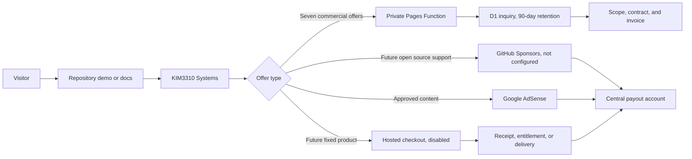

# Monetization Operating System

This is the operating source of truth for monetizing the 35 active GitHub
repositories without creating 35 payment accounts, policy stacks, or payout
flows.

## Revenue Rails

| Rail | Provider | Current state | Use |
| --- | --- | --- | --- |
| Private commercial intake | Cloudflare Pages Functions + D1 | Active locally; production migration and deploy automated | Audits, sprints, exercises, discoveries, pilots, and customization |
| Global hosted checkout | Provider not selected | Disabled until legal, tax, refund, payout, and fulfillment setup is complete | Future bounded one-time products |
| Open-source support | GitHub Sponsors | Sponsors listing not configured | Sustainable support for developer tools and public technical assets |
| Content advertising | Google AdSense | Two site reviews pending; ownership verified | All 35 repository resource pages through the central catalog, plus the direct dream-content site |
| High-trust B2B | Private scope and invoice | Intake route implemented | Enterprise, security, medical, regulated, civic, and industrial work |

The Google AdSense publisher identifier is public configuration, not a secret.
Payment, identity, tax, OTP, and bank details remain dashboard-only.

Two domains are connected to AdSense and have active site reviews:

- `dream-interpretation-pages.pages.dev`: ownership verified, review pending,
  and `ads.txt` approved.
- `kim3310-doeon-kim-portfolio.pages.dev`: ownership verified and review
  pending, with `ads.txt` approved.

The central catalog exposes 35 unique, crawlable repository resource pages
through `/resources/ad-data-sitemap.xml`; every resource page carries the
publisher account metadata and AdSense loader. This covers every active
repository without submitting duplicate, low-context application domains.
Direct high-trust B2B, security, medical, regulated, civic, and industrial
application surfaces remain ad-free.

The European consent message and US state opt-out message are both published.
AdSense has not exposed payment-method or identity-verification actions at the
current zero balance, so no bank account can be connected yet.

## One Commerce Plane

Every repository routes to:

`https://kim3310-doeon-kim-portfolio.pages.dev/?offer=<repo>#service-offers`

The gateway resolves a configured hosted checkout only when one exists and
otherwise routes to a server-validated private inquiry stored in Cloudflare D1.
GitHub issues remain public and must not be described as private intake.

## Seven Commercial Offers

| Lane | Repository count | Primary revenue unit | Advertising |
| --- | ---: | --- | --- |
| Architecture Scope Sprint | 3 | Fixed scope from USD 900 | Central public resource pages only |
| Agent Reliability Audit | 7 | Fixed audit from USD 1,500 | Central public resource pages only |
| Private AI Readiness Sprint | 6 | Discovery scope from USD 2,500 | Central public resource pages only |
| Incident Operations Exercise | 5 | Facilitated exercise from USD 1,800 | Central public resource pages only |
| Secure Workflow Pilot | 4 | Pilot scope from USD 2,000 | Central public resource pages only |
| Industrial Validation Discovery | 4 | Discovery scope from USD 2,500 | Central public resource pages only |
| Consumer Prototype Customization | 6 | Fixed customization from USD 1,000 | Central resources plus direct dream content |

The machine-readable ledger assigns every active repository to exactly one
lane and records visibility and advertising eligibility.

## Activation Order

1. Deploy and monitor the central private inquiry path before any checkout.
2. Validate offer language, price anchors, and delivery time with real buyer conversations.
3. Select a hosted checkout provider only after identity, tax, store, product,
   refund, and payout requirements are understood.
4. Add one hosted checkout URL per proven fixed-price offer through deployment variables.
5. Complete GitHub Sponsors onboarding and add funding links only after the
   profile is approved.
6. Keep the AdSense connection code, correct `ads.txt`, and the 35-entry
   resource sitemap live on the two submitted content domains.
7. Configure Google Privacy & Messaging for EEA, UK, and Switzerland traffic
   before serving personalized ads there.
8. Add the payout bank account inside each provider dashboard. Never store it
   in GitHub, source code, logs, screenshots, or automation artifacts.

## Guardrails

- Ads do not belong inside B2B, security, medical, regulated, civic, or
  industrial application and evaluation surfaces. Their separate public,
  non-diagnostic architecture-readiness resources may use contextual ads.
- A checkout button must not be enabled until its deliverable, delivery time,
  refund stance, support window, privacy disclosure, and tax treatment are
  published.
- Public issues may collect only non-sensitive product questions. Commercial scoping uses the private D1 intake.
- Private customer data moves to an approved private channel before evaluation.
- Revenue is not guaranteed; the operating system makes offers purchasable and
  measurable.

## Official Platform References

- [Google AdSense payment methods](https://support.google.com/adsense/answer/1714397)
- [Google AdSense ads.txt guide](https://support.google.com/adsense/answer/12171612)
- [Google AdSense CMP requirements](https://support.google.com/adsense/answer/13554116)
- [GitHub Sponsors setup](https://docs.github.com/en/sponsors/receiving-sponsorships-through-github-sponsors/setting-up-github-sponsors-for-your-personal-account)
- [Lemon Squeezy supported countries](https://docs.lemonsqueezy.com/help/getting-started/supported-countries)
